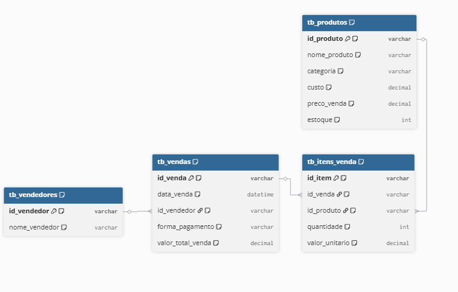
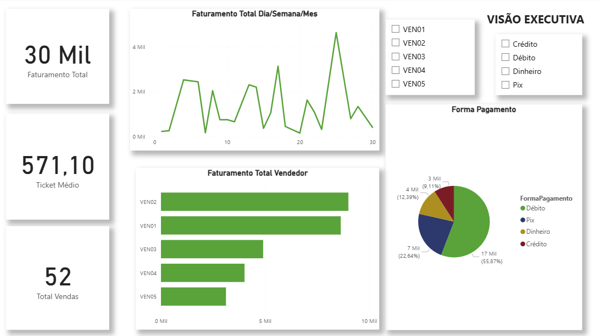
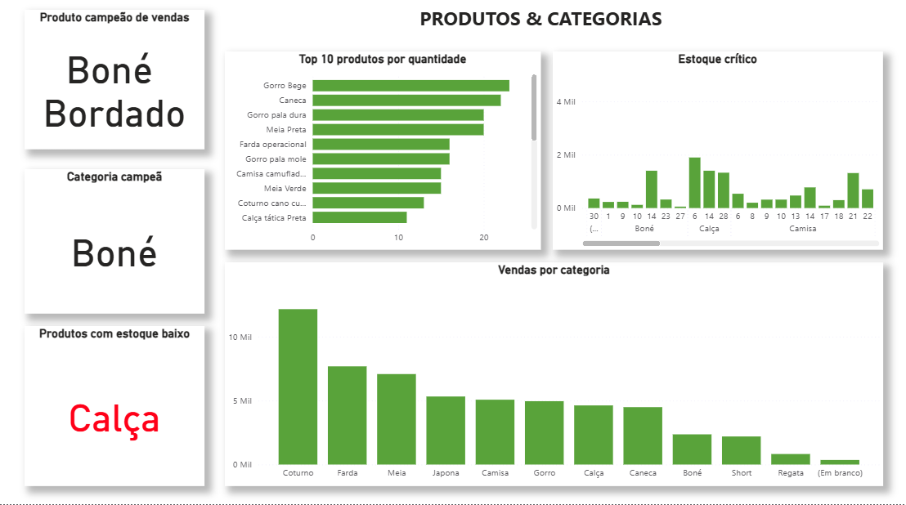
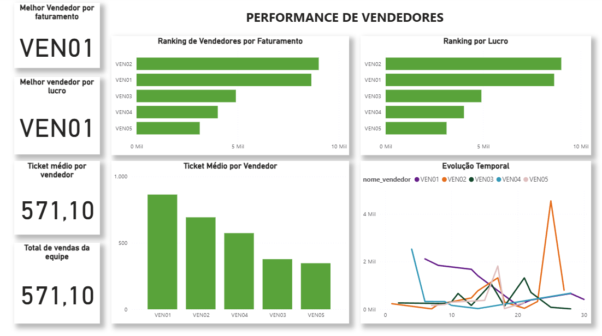

# Solução de Business Intelligence para Otimização de Gestão Comercial no Varejo

##  Visão Geral

Esta solução foi desenvolvida para transformar a gestão comercial de uma loja de varejo, substituindo processos manuais por uma arquitetura de dados eficiente e automatizada.

A solução surgiu da necessidade de superar as limitações do sistema anterior baseado em Google Forms, que apresentava falhas na organização e dificuldade no registro de vendas. A evolução para uma aplicação customizada em Streamlit permitiu centralizar a captação de dados em uma interface visualmente superior e muito mais intuitiva. Com essa migração, foi possível garantir a integridade de transações complexas (multi-item), estabelecer um fluxo de dados organizado e criar um pipeline analítico robusto que gera inteligência real para a tomada de decisão do negócio.

> **⚠️ Nota sobre Confidencialidade:** Todas as imagens e valores apresentados abaixo utilizam **DADOS FICTÍCIOS** para preservar informações estratégicas e comerciais do estabelecimento real.

---

##  Contexto e Evolução da Maturidade

Identifiquei que a gestão via formulários simples gerava ruído e perda de informação na loja. Ao desenvolver uma aplicação personalizada com Streamlit, consegui estruturar os dados de forma que o registro de vendas reflita a realidade do estoque e do financeiro. Além do ganho visual e da facilidade de uso para quem opera no dia a dia, a solução permitiu transformar dados brutos em inteligência de negócio real.

###  Stack Técnica Aplicada

*   **Interface de Ingestão (UX):** Python (Streamlit) — 
*   **Armazenamento Transacional:** Local Data Store (CSV/SQLite).
*   **Tratamento / ETL:** Python (Pandas).
*   **Modelagem Analítica:** SQL.
*   **Business Intelligence:** Power BI.

---

##  Arquitetura da Solução

### 1️ Ingestão Customizada (Python/Streamlit)
Desenvolvimento de uma aplicação web dedicada para o ponto de venda (PDV), implementando:
*   **Lógica Multi-item:** Registro de múltiplos produtos em uma única transação vinculada a um `id_venda` único.
*   **Data Quality na Origem:** Cálculos de subtotal em tempo real e campos pré-definidos, eliminando erros humanos e garantindo a padronização.

### 2️ Modelagem e Estruturação (SQL)
Transformação dos dados operacionais em uma base analítica escalável utilizando conceitos de **Star Schema**. A estruturação permite consultas rápidas e organizadas para ferramentas de BI.

*Figura 1: Esquema relacional das tabelas fato e dimensão (Dados Fictícios).*

---

##  Visualização Estratégica (Power BI)

Abaixo estão detalhadas as visões do dashboard desenvolvido para suporte à gestão:

###  Visão Executiva
Foco nos principais KPIs de saúde financeira: Receita, Lucro, Ticket Médio e tendências temporais para suporte à diretoria.

*Visualização de performance consolidada (Dados Fictícios).*

###  Produtos & Categorias
Análise detalhada de mix de produtos, curva ABC e lucratividade por item para otimização de compras.

*Análise de giro e lucratividade (Dados Fictícios).*

###  Performance Comercial
Acompanhamento de metas, produtividade individual e volume de vendas por colaborador.

*Ranking de performance de vendas (Dados Fictícios).*

###  Operação & Estoque
Monitoramento de estoque crítico, giro de produtos e identificação de capital imobilizado.

*Gestão de estoque e indicadores operacionais (Dados Fictícios).*

---

##  Competências Técnicas Aplicadas

*   **Application Development:** Streamlit & UI Design para ferramentas internas.
*   **Data Engineering:** ETL, Data Cleaning e Validation.
*   **Programming:** Python (Pandas).
*   **Database:** SQL & Data Modeling (Star Schema / Dimensional).
*   **Analytics:** Power BI, Linguagem DAX e KPI Design.

---

##  Conclusão

Este projeto demonstra a capacidade de transformar uma operação comercial real por meio de tecnologia. A evolução da ferramenta de coleta destaca o foco na qualidade do dado e na escalabilidade da solução analítica, consolidando competências essenciais para um profissional de Dados e BI.

**Autor:** Thiago Ferreira
