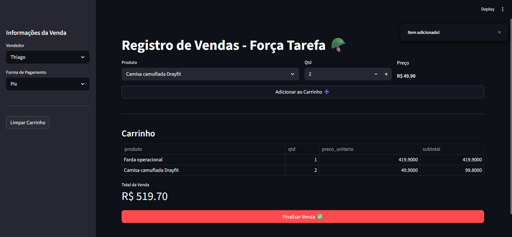

# Solução de Business Intelligence para Gestão Comercial no Varejo

## Visão Geral

Esta solução foi desenvolvida para estruturar e automatizar o processo de gestão comercial de uma operação de varejo, substituindo processos manuais por uma aplicação centralizada em Streamlit e uma arquitetura de dados voltada à análise.

A evolução do sistema permitiu a implementação de um fluxo de dados mais confiável, com suporte a transações multi-itens, padronização na origem e geração de uma base analítica estruturada para consumo em ferramentas de Business Intelligence.

---

## ⚠️ Confidencialidade

Todas as imagens e indicadores apresentados neste documento utilizam dados fictícios, com o objetivo de preservar informações sensíveis da operação real.

---

## Contexto do Problema

O processo anterior baseado em formulários apresentava limitações como:
- baixa estruturação dos dados
- dificuldade no registro de múltiplos produtos por venda
- inconsistências na consolidação para análise

Para resolver esse cenário, foi desenvolvida uma aplicação em Streamlit que centraliza o registro de vendas e estrutura os dados já na origem.

---

## Stack Técnica

- Interface de Ingestão: Streamlit (Python)  
- Armazenamento: CSV (camada transacional)  
- Processamento de Dados: Python (Pandas)  
- Modelagem de Dados: SQL (modelo dimensional)  
- Visualização: Power BI  

---

## Arquitetura da Solução

### 1. Camada de Ingestão (Streamlit)

Aplicação responsável pelo registro operacional das vendas, contendo:

- suporte a múltiplos produtos por transação (carrinho de compras)  
- cálculo automático de subtotais e total da venda  
- geração de identificador único (id_venda)  
- padronização dos dados no momento da entrada  

📌 Interface do sistema de registro:

---

### 2. Camada de Dados (CSV)

Os dados são armazenados em formato transacional estruturado, permitindo rastreabilidade completa das vendas e histórico operacional.

---

### 3. Camada de Modelagem (SQL)

Os dados são estruturados em modelo analítico para consultas e exploração, permitindo:

- análise por produto  
- análise por vendedor  
- análise temporal  
- suporte a dashboards de BI  

📌 Modelagem de dados:

---

### 4. Camada de Visualização (Power BI)

Os dados são transformados em dashboards analíticos para suporte à tomada de decisão.

#### Visão Executiva

Acompanhamento de KPIs principais como receita, ticket médio e evolução de vendas.

---

#### Análise de Produtos

Identificação de produtos mais vendidos e análise de mix de vendas.

---

#### Performance Comercial

Avaliação de desempenho por vendedor e ranking de performance.

---

#### Operação

Monitoramento de fluxo operacional e visão geral das vendas.

---

## Competências Técnicas Aplicadas

- Desenvolvimento de aplicação com Streamlit  
- Manipulação de dados com Python (Pandas)  
- Estruturação de dados para análise  
- Modelagem relacional e analítica com SQL  
- Construção de dashboards com Power BI  
- Design de pipeline de dados ponta a ponta  

---

## Conclusão

Esta solução demonstra a transformação de um processo operacional manual em uma arquitetura de dados estruturada, com foco em confiabilidade, organização e suporte à tomada de decisão.

O sistema implementado permite capturar, estruturar e analisar dados de vendas de forma integrada, simulando um ambiente real de operação comercial com pipeline completo de dados.
